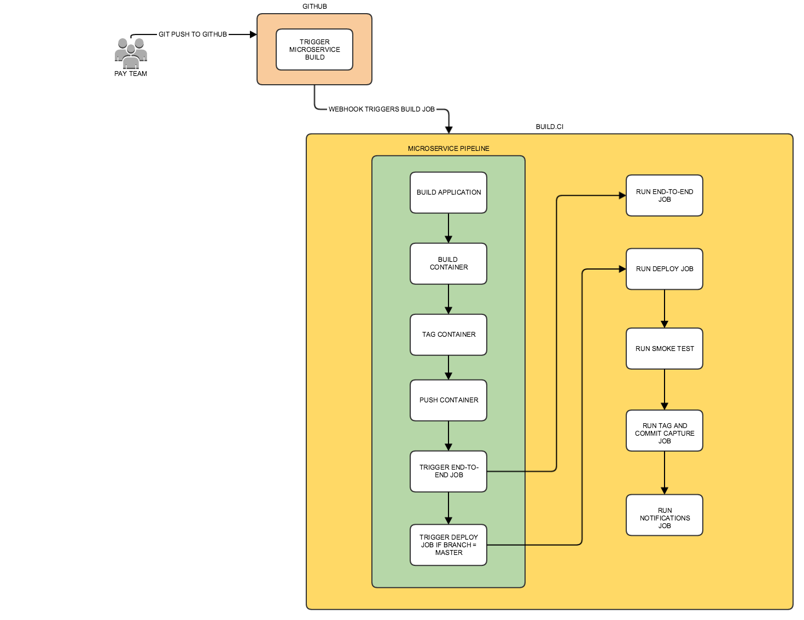

# What

pay-jenkins-library is a Jenkins library helper, intended to be used
with GOV.UK Pay Jenkins.

This library gets automatically loaded and made available via Jenkins global libraries.

If you want to have Jenkinsfile pull in a branch of this repo, add the below to your
Jenkinsfile.

```
libraries {
  lib("pay-jenkins-library@master")
}
```
### Functions this Jenkins global library

#### Git tag

- Tags the current git repo with the provided tag
- Pushes the tag to the remote repository
- Optional second argument for an annotation

```groovy
    gitTag(tag, annotation)
```

#### Build app

- Builds a docker container, tags and pushes to a registry
  Only 'app' is required, the rest default to the below

```groovy
buildApp{
  app = 'foo'
  registry = 'docker.io'
  docker_repo = 'govukpay'
  push = true
}
```

#### Notifications

- Notifies buildStatus via the below:
  * Slack

```
sendNotifications("BUILD_STATUS")
```

#### Run end to end test

- Runs e2e tests, pulling docker tag of specific app

```groovy
runEndToEnd('app')
```

#### Get current HEAD of branch i.e. GIT_COMMIT

```
gitCommit()
```

#### Get current branch name i.e. GIT_BRANCH

```
gitBranch()
```

#### Get if current branch is master

```
isBranchMaster()
```

#### Deploy a microservice to an environment

- Deploys a microservice to an environment by triggering
  the deploy job passing in params.
  `tag` is optional, defaults to 'latest-master'

```
deploy('microservice', 'aws_account', tag)
```

## Example microservice build pipeline




